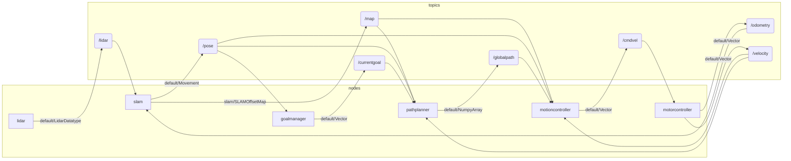

# Between-Node Communication Diagram

/ TODO: change structure from [nodes] [topics] to [node 1 topics 1] [node 2 topics 2] etc

@ is ANON receive, / is TOPIC send

- lidar
/lidar (miniros/LidarDatatype)
@ping (None)

- slam
/map (slam/SLAMOffsetMap)
/pose (miniros/Movement)

- pathplanner
/globalpath (miniros/NumpyArray)

- motioncontroller
/cmdvel (miniros/Vector) (left, right, none)

- goalmanager
/currentgoal (miniros/Vector) (x, y, 0)

- motorcontroller
/odometry (miniros/Vector) (x, y, theta)
/velocity (miniros/Vector) (v, omega, 0)